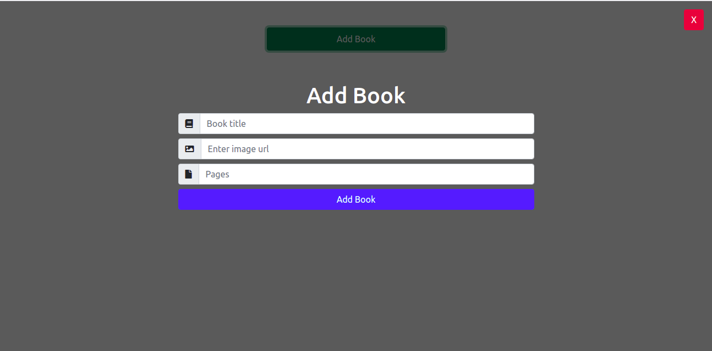
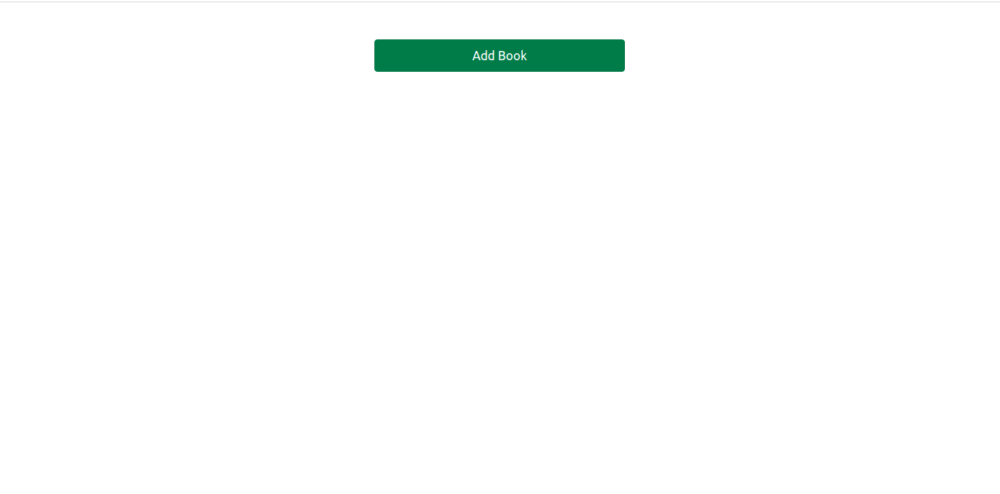

# MyLibraryAppV1

In this project, we built a basic web-based library application using JavaScript. One can add books to the library, delete the books and mark the book as read. We use local storage to store the data from the user.




## Built With

- JavaScript
- Html
- Bootstrap

### System requirements

- Web Browser


## Getting Started

To get a local copy of the repository please run the following commands on your terminal:

```
$ cd <folder>
```

```
$ git clone git@github.com:verissimohenry/Library-Appv1.git
```

```
$ cd LibraryAppV1

## Setup

```run `npm install` to install all required node modules

## Usage

double click on  `index.html` to open project in new browser window`

## Authors

👤 **Verissimo Henry**

- Github: [@githubhandle](https://github.com/verissimohenry)
- Twitter: [@twitterhandle](https://twitter.com/verissimohenry)
- Linkedin: [linkedin](https://www.linkedin.com/in/henry-verissimo-618906167/)
- Email: verissimohenry04@gmail.com

## 🤝 Contributing

Contributions, issues, and feature requests are welcome!

## Show your support

Give a ⭐️ if you like this project!

## Acknowledgments

- [Odin Projects](https://www.theodinproject.com/courses/)
- [Microverse](https://microverse.com)

## 📝 License

This project is [MIT](https://mit-license.org/) licensed.
